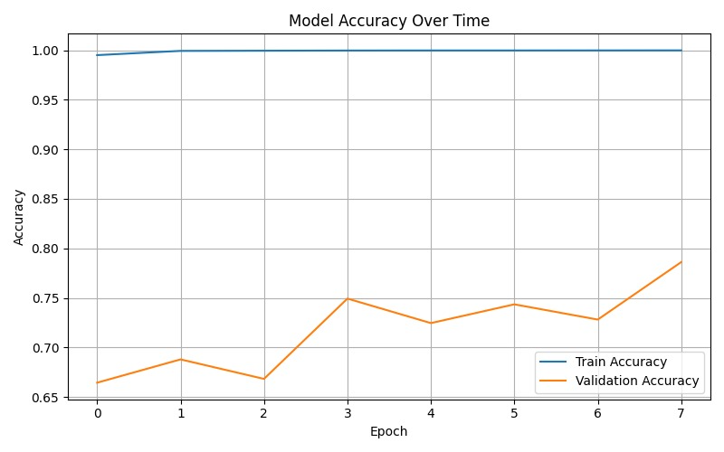

# AI Driver Drowsiness Detection System

An academic edge-AI prototype for detecting driver drowsiness from an infrared-capable camera feed and issuing an audible alert on a Raspberry Pi.

This final-year Computer Engineering project was developed by **Amidu Gerald and Clifford Opare** at Ghana Communication Technology University in 2025.

> **Project status:** Research prototype. It is not a production-certified automotive safety system and must not be relied on as the sole means of preventing drowsy-driving incidents.

## Prototype overview

The implemented pipeline combines two complementary signals:

- a compact Convolutional Neural Network (CNN) that classifies camera frames;
- Eye Aspect Ratio (EAR) measurements from facial landmarks, calibrated per driver and smoothed over time.

When sustained eye closure or a high-confidence drowsy classification is detected, the Raspberry Pi activates an audible GPIO-controlled alert. The trained Keras model was converted to TensorFlow Lite for edge inference.

Reinforcement learning, steering-wheel sensing, and haptic feedback were part of the proposed architecture and remain future work; they were not included in the validated prototype.

## Highlights

- Real-time vision processing with OpenCV and MediaPipe Face Mesh
- CNN training and TensorFlow Lite conversion
- Raspberry Pi 4 and infrared-capable camera deployment design
- Per-driver EAR calibration and temporal smoothing
- GPIO PWM speaker alerts
- Offline-first processing for lower latency and improved privacy

## Documented results

The report records eight training epochs for the compact CNN:

- Peak validation accuracy: **78.61%**
- Training accuracy: approximately **99-100%**
- Main finding: a substantial generalization gap indicated overfitting and limited subject diversity

These results support the feasibility of the pipeline but do not establish production-level reliability. The report recommends a more diverse dataset, subject-wise evaluation, transfer learning with MobileNetV2, stronger augmentation, and quantization-aware training.



## Repository structure

```text
.
|-- src/
|   |-- balance_dataset.py
|   |-- convert_model.py
|   |-- extract_frames.py
|   |-- real_time_detection.py
|   `-- train_model.py
|-- docs/
|   |-- architecture.md
|   |-- results.md
|   `-- assets/
|-- requirements-desktop.txt
|-- requirements-raspberry-pi.txt
`-- .gitignore
```

The Python files were reconstructed from the code listings in the project report appendix. Formatting defects introduced by the Word document were corrected, and basic safety checks were added. The original dataset, trained model, and complete development environment were not available when this repository was prepared.

## Development pipeline

1. Extract and resize labeled video frames:

   ```bash
   python src/extract_frames.py "Drowsiness Dataset" image_dataset
   ```

2. Balance class folders by undersampling:

   ```bash
   python src/balance_dataset.py image_dataset balanced_dataset --seed 42
   ```

3. Train the compact CNN:

   ```bash
   python src/train_model.py balanced_dataset
   ```

4. Convert the saved Keras model to TensorFlow Lite:

   ```bash
   python src/convert_model.py path/to/model.h5 driver_drowsiness_model.tflite
   ```

5. On a configured Raspberry Pi, place the TFLite model in the project root and run:

   ```bash
   python src/real_time_detection.py
   ```

## Hardware described in the report

- Raspberry Pi 4 (4 GB)
- Picamera2-compatible or USB infrared-capable camera
- PWM speaker on GPIO 18
- Optional vibration sensor, vibration motor, and LED indicators (proposed extensions)

## Privacy and responsible use

The prototype is designed for local processing and does not require cloud video transmission. Anyone extending it should obtain informed consent for facial data, minimize retention, protect recordings and logs, and validate performance across diverse drivers and lighting conditions.

## Documentation

- [Architecture and implementation notes](docs/architecture.md)
- [Training results and limitations](docs/results.md)

## Attribution

Final-year project by Amidu Gerald and Clifford Opare, supervised by Dr. Isaac Osei Nyantakyi, Ghana Communication Technology University, 2025.

