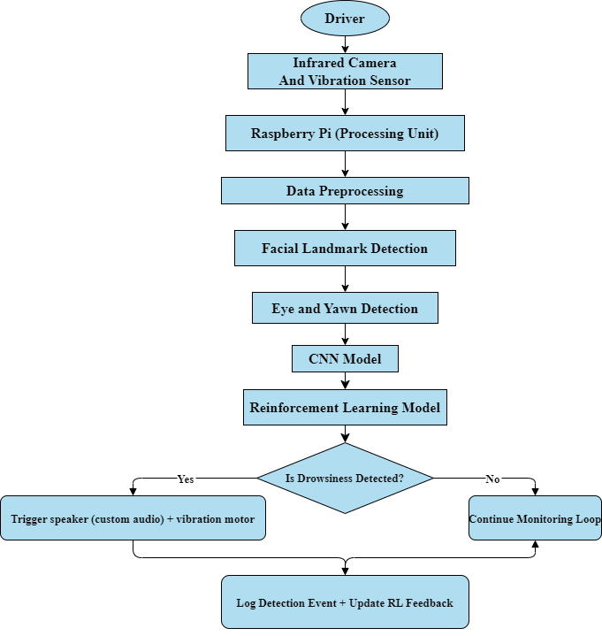
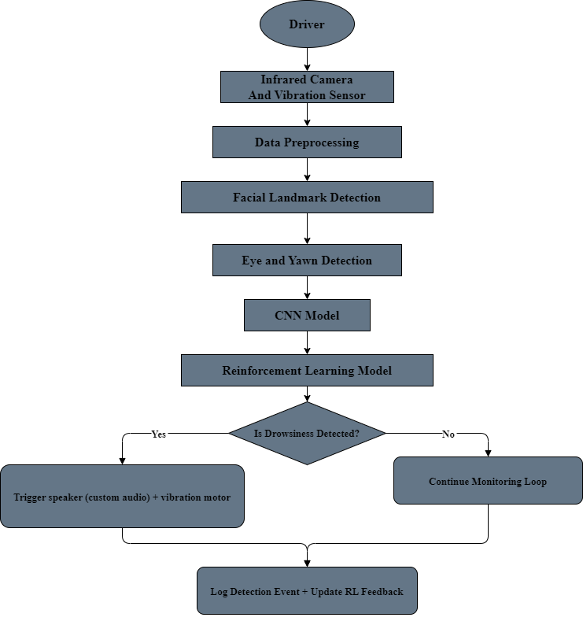
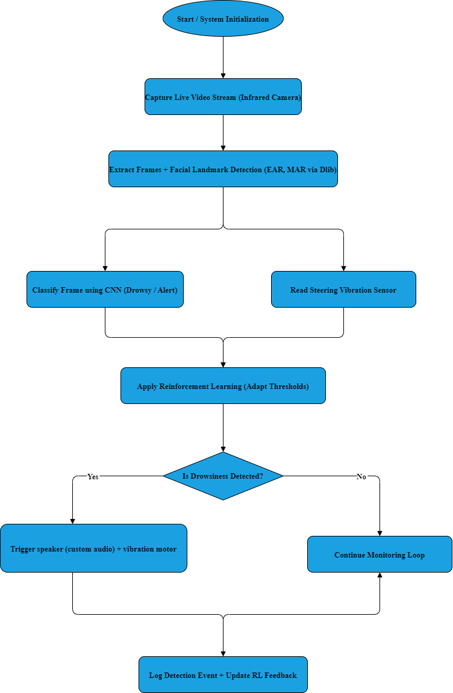
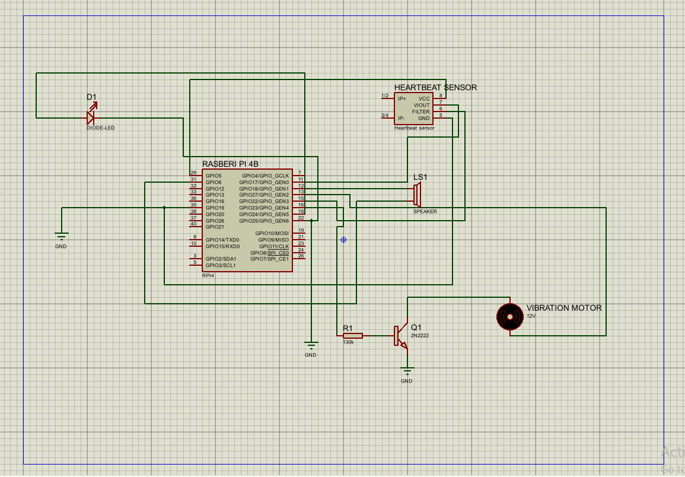
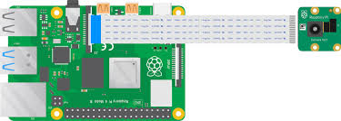

# Architecture and implementation notes

## Implemented prototype

The report's final implementation uses an infrared-capable camera, Raspberry Pi 4, MediaPipe Face Mesh, Eye Aspect Ratio (EAR), a compact CNN converted to TensorFlow Lite, and a PWM speaker alert.

The runtime flow is:

1. Capture a 640 x 480 camera frame.
2. Detect facial landmarks with MediaPipe Face Mesh.
3. Calculate left and right EAR values.
4. Smooth EAR measurements over a seven-frame window.
5. Calibrate the threshold from the driver's median open-eye EAR.
6. Run the 244 x 244 grayscale frame through the TFLite classifier.
7. Trigger the speaker when sustained eye closure reaches four seconds or the CNN predicts drowsiness above 0.7 confidence.

## Proposed architecture

The original report proposed reinforcement-learning personalization, a steering-wheel vibration sensor, and haptic feedback. Those elements are shown in the academic diagrams below but were not implemented in the validated prototype.

## Hardware artifacts

The report also includes a Proteus circuit simulation and a Raspberry Pi camera setup.

